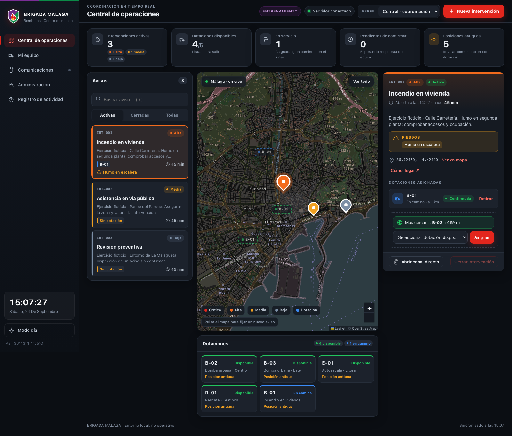
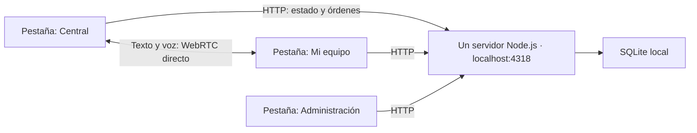

# Brigada Málaga · FireFighterApp

Aplicación de coordinación de equipos de bomberos con central de operaciones,
cliente para tablet, mapa de Málaga, administración y comunicación directa
entre navegadores mediante **WebRTC**. La versión actual moderniza el prototipo
original de AngularJS, LoopBack y MongoDB conservando su código histórico.

**Estado: versión local de desarrollo y entrenamiento.** Funciona con perfiles
simulados y datos ficticios. Todavía no es un sistema autenticado para una red
operativa ni una aplicación aprobada para atender emergencias.



## Empezar

Requisitos: **Git, Node.js 24.19 o posterior y npm**. No necesitas instalar
MongoDB, SQLite por separado, Bower, Docker ni claves de Google Maps.

Mientras V2 esté en revisión, clona la rama que contiene esta versión:

```sh
git clone --branch codex/modernize-firefighter-v2 https://github.com/Carlosml26/FireFighterApp.git
cd FireFighterApp/v2
node --version
npm ci
npm start
```

Si usas nvm, `nvm install` y `nvm use` dentro de `v2/` seleccionan la versión de
`.nvmrc`. Cuando V2 se integre en `master`, podrás clonar sin `--branch`.

Abre **[http://127.0.0.1:4318](http://127.0.0.1:4318)**. El primer arranque sobre
una base vacía crea cinco equipos y tres intervenciones ficticias. Los cambios
se guardan entre reinicios. Para detener el servidor, pulsa `Ctrl+C`.

[Instalación detallada, Windows y configuración](v2/docs/installation.md).

## Qué incluye

| Espacio | Funciones |
| --- | --- |
| **Central** | Cola de avisos por prioridad, riesgos, tiempo transcurrido, dotaciones asignadas, mapa y tablero de dotaciones. Creación de avisos, asignación, retirada y cierre. |
| **Mi equipo** | Confirmar o rechazar avisos, comunicar salida y llegada, compartir posición y finalizar misión. Botones grandes y riesgos destacados. |
| **Comunicaciones** | Texto, mensajes rápidos y notas de voz P2P con confirmación de recepción. |
| **Administración** | Registrar y editar indicativos, nombres y capacidades de los equipos. |
| **Registro** | Consultar, buscar y exportar a JSON los cambios operativos. |

La interfaz incorpora un emblema propio —no el escudo oficial—, tema oscuro por
defecto, **Modo día** recordado en el navegador y navegación inferior en móvil.
La central ofrece plantillas de aviso, zonas aproximadas de Málaga, sugerencias
de cercanía y atajos `N` y `/`.

Las distancias son en línea recta según la última posición registrada; no son
rutas ni ETA y pueden utilizar posiciones antiguas. Las zonas son puntos de
partida editables. **Cómo llegar** abre Google Maps en otra pestaña. Sonido y
vibración dependen del navegador y de sus permisos; no son alertas garantizadas.

[Guía de uso del frontend](v2/docs/user-guide.md).

## Cómo se conectan servidor y clientes



**Un servidor y tantas pestañas como clientes quieras probar.** El mismo proceso
sirve el frontend, la API y la señalización para establecer WebRTC. SQLite guarda
los datos operativos. El estado se consulta cada tres segundos; el reloj visible
se actualiza cada segundo, sin implicar que haya llegado una nueva posición.

Para probar comunicaciones, abre dos pestañas de la **misma URL**. Mantén
**Central** en una y selecciona **B-01** en la otra. En ambas entra en
**Comunicaciones**, elige **Incendio en vivienda** y pulsa **Conectar al canal**.
Con el canal directo conectado podrás enviar texto, mensajes rápidos y voz.
El chat es temporal; las órdenes y asignaciones quedan en SQLite.

[Conectar clientes paso a paso y límites de acceso desde tablets](v2/docs/installation.md#conectar-dos-clientes).

## De dónde salen los datos

- `v2/src/training.js` genera el escenario ficticio una vez, solo con una base vacía.
- `v2/data/brigada.sqlite` conserva equipos, avisos, asignaciones, posiciones,
  auditoría y resultados de comandos para reintentos idempotentes.
- OpenStreetMap proporciona el fondo cartográfico. No hay conexión con una base
  municipal ni importación automática del MongoDB antiguo.
- Los mensajes y audios se mantienen en memoria del navegador durante el canal;
  no se almacenan en la base del servidor.

[Modelo de datos y arquitectura](v2/docs/architecture.md) ·
[Backup y recuperación](v2/docs/runbook.md).

## Documentación

| Para… | Guía |
| --- | --- |
| Entender alcance, requisitos y funciones pendientes | [Requisitos](v2/docs/requirements.md) |
| Instalar, configurar y conectar clientes | [Instalación y conexión](v2/docs/installation.md) |
| Usar central, tablet, administración y chat | [Manual de uso](v2/docs/user-guide.md) |
| Entender módulos, permisos y flujos | [Arquitectura](v2/docs/architecture.md) |
| Consumir la API y entender errores/reintentos | [Guía de API](v2/docs/api-guide.md) y [OpenAPI](v2/openapi.yaml) |
| Entender el transporte directo y sus límites | [WebRTC](v2/docs/communications.md) |
| Actualizar, respaldar y recuperar | [Mantenimiento](v2/docs/runbook.md) |
| Revisar qué se ha comprobado | [Verificación](v2/docs/verification.md) |
| Contribuir cambios reproducibles | [Desarrollo](CONTRIBUTING.md) |

[Índice completo de documentación](v2/docs/README.md).

## Desarrollo y comprobaciones

Desde `v2/`:

```sh
npm run check
npm run format:check
npm test
npm audit --omit=dev
npx playwright install chromium
npm run test:e2e
```

No hay un paso de compilación del frontend: se sirven módulos ES nativos.
Las pruebas de navegador arrancan su propio servidor en el puerto **4320** con
base en memoria. No modifican la sesión de entrenamiento del puerto 4318.
La [CI](.github/workflows/v2-ci.yml) ejecuta estos controles en GitHub.

## Organización y estado del proyecto

```text
v2/
  src/               Dominio, servidor HTTP, SQLite, señalización y entrenamiento
  public/console/    Frontend actual en español
  test/              Dominio, HTTP, permisos, persistencia y señalización
  e2e/               Recorridos de navegador y WebRTC
  docs/              Guías y capturas
serverDB/            Prototipo histórico: AngularJS, LoopBack y MongoDB
signalServer/        Servidor de señalización histórico
```

El código histórico está preservado; no se arranca como parte de V2.
[Auditoría histórica](docs/legacy-audit.md) ·
[Plan de modernización](docs/modernization-plan.md) ·
[Descripción anterior](docs/legacy-readme.md).

La conexión desde tablets físicas requiere una siguiente etapa con identidad
verificada, HTTPS, configuración de orígenes, red y TURN probados. Cambiar
`HOST` a `0.0.0.0` no la habilita: la aplicación rechaza expresamente ese modo.
No se ha migrado MongoDB ni desplegado la aplicación para uso operativo.

El paquete está marcado **UNLICENSED** y privado en npm; no se declara una
licencia de código abierto para el proyecto. Las dependencias mantienen sus
propias licencias. Véase [SECURITY.md](SECURITY.md) para los límites de soporte.
