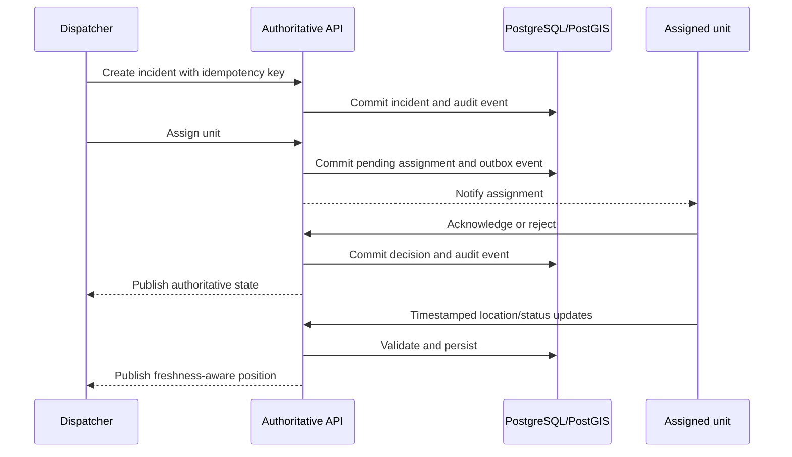

# FireFighterApp V2 modernization plan

## Local implementation update · 2026-09-26

The local V2 application now includes a Spanish dispatcher console, a tablet
crew view, unit administration, a real Leaflet/OSM map, SQLite persistence,
durable operational audit/idempotency, and incident-scoped WebRTC text/voice
with delivery acknowledgements. See [the current implementation](../v2/README.md).

The user's September clarification identifies the original distinguishing
feature as frontend-to-frontend communication and the historical database.
The local scope therefore restores WebRTC and persistence; road navigation,
off-grid hardware and historical data migration are not inferred requirements.
The future architecture below remains a roadmap, not a claim of deployed work.
OIDC, network access, PostgreSQL/PostGIS, durable messaging, TURN and field pilot
acceptance remain future gates.

## Product goal

A resilient fire-service coordination platform in which dispatchers create and
manage incidents, assign operational units, receive explicit acknowledgement
and fresh status/location, and communicate with incident participants through
audited channels that degrade visibly and safely when connectivity is poor.

This software supplements approved emergency procedures. Existing radio and
dispatch systems remain authoritative throughout prototyping and shadow-mode
pilots.

## Discovery decisions required

- Which rugged phones/tablets, browsers, operating systems, vehicle terminals,
  and MDM are actually available?
- Is off-grid operation required, or only resilience across municipal Wi-Fi and
  cellular networks? True off-grid truck-to-truck communication requires a
  separately validated radio/private-LTE/MANET hardware track.
- Which CAD/112, radio, hydrant, pre-incident plan, traffic, and vehicle systems
  must interoperate?
- What are the location/message retention, access, export, and deletion rules?
- What unit/incident concurrency and position update frequency must be
  supported?

## Target domain

- Organization, station, user, and role
- Crew/operational unit, vehicle/apparatus, capabilities, and managed device
- Incident, location, priority, hazards, lifecycle, and command structure
- Assignment, acknowledgement, rejection reason, and unit status
- Position with captured time, received time, accuracy, source, and freshness
- Incident channel, message/voice note, delivery state, and membership
- Append-only audit event

Initial roles: dispatcher, incident commander, crew leader, system
administrator, and auditor.

## Target architecture

### Applications

- **Dispatcher console:** TypeScript and React, optimized for concurrent
  dispatch, large maps, keyboard workflows, and explicit stale/error states.
- **Field client:** choose native or cross-platform only after testing the
  issued device fleet. It needs background location/notifications, encrypted
  local state, offline maps, large glove-friendly controls, daylight/night
  themes, and driving-safe interaction constraints.

### Authoritative platform

- A modular API service on a currently supported LTS runtime.
- PostgreSQL plus PostGIS for relational operational state and spatial queries.
- Durable event/outbox records for real-time fan-out and integrations.
- Authenticated WebSocket or server-sent events for state notifications.
- Object storage for voice notes and attachments, with malware/type/size checks
  and retention controls.
- OIDC identity, MFA for privileged roles, short-lived tokens, managed device
  identity, and server-enforced RBAC/incident membership.

### Communications

The server path is the durable baseline. WebRTC can be an optional low-latency
path after authenticated signaling, incident-scoped authorization, and TURN are
available. Direct, relayed, queued, delivered, failed, and offline states must
be visible. Peer transport must never be the only system of record.

### Operations

- TLS everywhere, secrets manager, least-privilege service identities, audit
  export, rate/size limits, and dependency/container scanning.
- Structured logs, metrics, traces, alerting, synthetic dispatch checks, and
  privacy-preserving diagnostics.
- Versioned database migrations, tested backups/restores, high availability,
  documented failover/rollback, and incident response ownership.

## State flow

## Delivery stages and gates

### Stage 0 — Discovery and safety contract

- Approve a current-versus-intended feature matrix with dispatcher and crew
  representatives.
- Document five field scenarios: dispatch, reassignment, connectivity loss,
  multi-unit communication, and closure.
- Agree target devices, service levels, retention, fallback, and success
  measures.

### Stage 1 — Secure authoritative core

- Authenticated identity, RBAC, normalized domain, PostgreSQL/PostGIS, versioned
  API, idempotent commands, migrations, audit events, CI, tests, and backups.
- A service restart cannot lose open incidents, assignments, or audit history.
- Every state change is authenticated, authorized, idempotent, and attributable.

The executable `v2/` reference is the first bounded slice of this stage. It
defines and tests the state transition contract and a dependency-free reference
UI before persistent storage and production identity are selected.

### Stage 2 — Operational MVP

- Dispatcher incident board/map and a field client.
- Assignment acknowledge/reject, lifecycle status, location freshness, durable
  text/voice notes, and notifications.
- Two dispatchers can work concurrently; reconnecting clients converge on
  authoritative state; duplicate/reordered commands cannot corrupt state.

### Stage 3 — Degraded-mode communications

- Secure durable messaging first; authenticated WebRTC plus TURN as an optional
  path; store-and-forward and local incident/map cache.
- Test restrictive NAT, Wi-Fi/cellular handoff, outages, server restart, message
  reconciliation, membership removal, and offline access.

### Stage 4 — Shadow-mode field pilot

- Exercise-only or shadow operations with official radio still authoritative.
- Measure acknowledgement time, location freshness, delivery rate, crash-free
  sessions, battery impact, and task completion.
- Run day/night, poor-signal, device-reboot, and dispatcher-failover drills.

### Stage 5 — Production and integration

- Integrate approved CAD/112, hydrants/preplans, telemetry, routing/ETA, MDM,
  monitoring, high availability, and disaster recovery.
- Require independent security/privacy review, failover/restore/rollback drills,
  training, support ownership, and operations leadership sign-off.

## First slice done-when

- A dispatcher can create a valid incident and assign an available unit.
- Dispatch can explicitly cancel/recall a pending or acknowledged assignment.
- The assigned unit can acknowledge it and progress through en-route, on-scene,
  and clear states.
- Location updates carry capture time and accuracy and reject stale or
  non-monotonic input and physically implausible jumps.
- Wrong-role or wrong-unit operations fail server-side.
- Repeated commands with the same idempotency key return the original result
  without duplicating state or audit events.
- Every accepted state transition creates an immutable, attributable audit
  event.
- Tests run on a supported LTS Node.js version with no third-party runtime
  dependencies and no known production dependency vulnerabilities.
