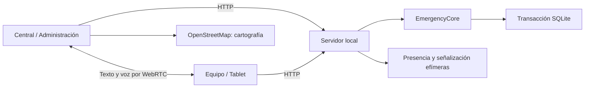
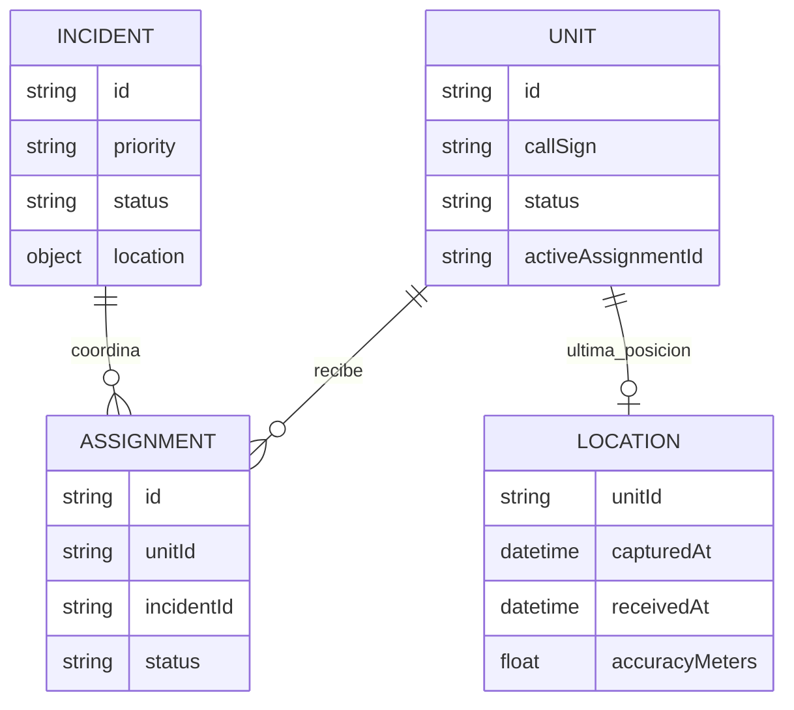
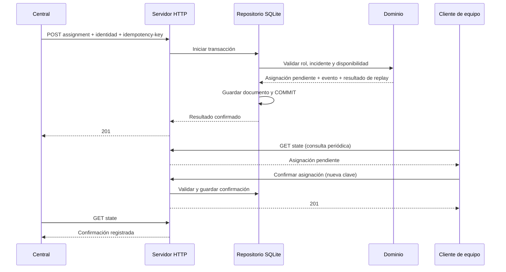

# Arquitectura de la versión local

Se amplía el núcleo V2 existente y se conserva el prototipo histórico. No se
intenta ejecutar AngularJS, LoopBack 3 ni Bower con dependencias actuales. Las
reglas de asignación y localización siguen en el dominio: el frontend no puede
saltarse una transición inválida.

## Módulos

| Módulo | Responsabilidad |
| --- | --- |
| `src/domain.js` | Validación, permisos, estados, idempotencia, auditoría |
| `src/repository.js` | Commit conjunto de estado, auditoría y claves de replay |
| `src/http-server.js` | HTTP, límites, loopback, cabeceras, rutas y recursos |
| `src/signaling.js` | Autorización de participantes, presencia y buzones SDP/ICE |
| `src/training.js` | Escenario ficticio inicial idempotente |
| `public/console/api.js` | Adaptador HTTP e identidad de desarrollo |
| `public/console/app.js` | Vistas, formularios y coordinación de acciones |
| `public/console/map.js` | Leaflet, marcadores y selección de coordenadas |
| `public/console/radio.js` | Conexiones, mensajes, confirmaciones y audio P2P |
| `public/console/ui.js` | Escape, etiquetas, formatos y componentes pequeños |

## Datos e integridad

SQLite guarda un documento versionado con incidentes, unidades, asignaciones,
posiciones, eventos y claves de idempotencia. `BEGIN IMMEDIATE`, WAL y
`synchronous=FULL` permiten guardar operación y evento juntos. La respuesta
HTTP se emite después del commit. Si falla la escritura, se restaura también
el estado en memoria. Un replay tras reiniciar devuelve el mismo resultado para
el mismo actor, clave, operación y cuerpo.

Este adaptador está diseñado para **un único proceso local** y conjuntos de datos
pequeños. Reescribe el documento completo en cada comando; no es un modelo
relacional de producción ni permite múltiples instancias compartiendo archivo.
Antes de escalar se requiere adaptar las reglas de dominio a tablas,
transacciones y un outbox, con PostgreSQL/PostGIS como candidato.

Las posiciones no se refrescan artificialmente: caducan según el reloj. Las del
escenario inicial están etiquetadas `source=training`. Cambiar un indicativo o
nombre no altera el estado operativo ni la asignación activa.

## Comunicación y acceso

Los comandos operativos tienen registro duradero. El chat es temporal y directo:
texto y audio no se envían por HTTP ni se guardan en SQLite. Las señales SDP/ICE
y la presencia caducan en memoria. El chat no sustituye el registro de órdenes.
Véase el [contrato del canal](communications.md).

El API usa cabeceras de identidad de desarrollo. Rechaza hosts ajenos a loopback
y orígenes HTTP distintos. Los permisos se comprueban en dominio y señalización.
Un equipo consulta su unidad y sus incidentes; la central ve el conjunto.
Administración edita unidades y consulta auditoría, pero no entra en chats
operativos como administrador.

Estas restricciones permiten una revisión local; **no autentican usuarios
reales**. Antes de habilitar acceso externo se requieren OIDC/sesiones,
autorización ligada a identidad verificada y gestión de dispositivos.

## Frontend y desconexión

Módulos ES nativos, CSS adaptable, formularios etiquetados y contenido escapado.
Se consulta señalización cada segundo y estado cada tres. No hay una cola offline
que pueda ejecutar después órdenes antiguas. La interfaz indica pérdida de
sincronización y errores; el service worker anterior se retira para no servir
una interfaz obsoleta.

Leaflet 1.9.4 se instala con lockfile y se sirve localmente. Solo la cartografía
base se descarga de OpenStreetMap, con atribución visible. No hay descargas
masivas, precarga ni mapas offline. Se avisa si falla la carga de teselas.

## Fuentes técnicas consultadas

- [RTCPeerConnection, MDN](https://developer.mozilla.org/en-US/docs/Web/API/RTCPeerConnection)
- [SQLite, Node.js](https://nodejs.org/api/sqlite.html)
- [Referencia de Leaflet](https://leafletjs.com/reference.html)

## Modelo lógico y almacenamiento físico

Este diagrama describe relaciones **lógicas**, no tablas SQL separadas. La tabla
física `application_state` tiene un único registro (`id = 1`) con el documento
JSON versionado. El estado incluye también auditoría y claves/resultados de
idempotencia. No existen entidades independientes de usuario real, vehículo,
parque o turno en el modelo actual.

`LOCATION` conserva la última posición de cada unidad, no un recorrido GPS.
La frescura se calcula al consultar: hasta 30 segundos `fresh`, hasta 120 segundos
`aging`, y después `stale`. Los tiempos registrados son ISO/RFC3339; el frontend
los presenta en la zona horaria del navegador.

Los nombres y capacidades son datos operativos de una unidad. Cambiar de perfil
no crea una cuenta: construye cabeceras de desarrollo. El directorio de perfiles
se publica mediante `/v1/local-context` únicamente dentro del entorno loopback.

## Ciclo de una orden

El reintento idéntico devuelve el resultado guardado sin un segundo evento.
El rollback restaura memoria y SQLite si falla el commit. La auditoría es
append-only mediante la API, pero no está firmada ni es inmutable frente a quien
pueda modificar el archivo local. El snapshot completo se carga al arrancar:
no hay sincronización entre varios procesos ni alta disponibilidad.

## Estados y autorización

El recorrido normal de unidad es `available → assigned → en_route → on_scene
→ available`. `assigned → en_route` requiere confirmación previa. Rechazar o
retirar una asignación libera la unidad. No se permite saltarse la misión
marcándola no disponible. El aviso pasa de `open` a `closed` solo cuando no hay
asignaciones pendientes/confirmadas activas.

| Rol del API | Responsabilidad |
| --- | --- |
| `dispatcher` | Visión general, creación/cierre de avisos, alta y asignación/retirada de equipos |
| `incident_commander` | Comandos de intervención; no perfil independiente en la UI actual |
| `crew_leader` | Estado visible de su unidad y avisos asociados, respuesta, estado y ubicación propios |
| `system_admin` | Alta/edición de unidades y auditoría; no participa como admin en chat |
| `auditor` | Consulta de estado y auditoría; no perfil independiente en la UI actual |

## Lo que ocurre en el frontend

La navegación usa fragmentos de URL (`#dispatch`, `#field`, etc.) dentro de una
misma aplicación, con vistas distintas según el perfil. No son servicios web
separados ni aplicaciones nativas. El tema se guarda localmente en el navegador;
las decisiones operativas no dependen de ese almacenamiento.

Las plantillas de aviso y las zonas de Málaga están definidas en
`public/console/app.js`; las distancias se calculan en `ui.js` con la fórmula de
gran círculo. Las sugerencias no filtran por antigüedad de posición ni calculan
ruta/ETA. Las animaciones, reloj, pitidos e intentos de vibración son del cliente,
no eventos de un sistema de notificación móvil.

## Conectividad exterior y evolución

- OpenStreetMap recibe solicitudes de teselas para el fondo; Leaflet se sirve
  localmente. La CSP restringe las fuentes de imagen autorizadas.
- «Cómo llegar» envía el destino a Google Maps cuando el usuario abre ese enlace.
- No se configuran servidores STUN/TURN externos; el alcance validado es local.
- Host y Origin se restringen al loopback HTTP. Habilitar un proxy público exige
  rediseñar identidad y configuración de orígenes, no simplemente reenviar puertos.
- El service worker antiguo se retira; no se garantiza funcionamiento offline
  ni una aplicación instalable con datos sincronizados en segundo plano.

La evolución hacia un servicio de red está descrita en el
[plan de modernización](../../docs/modernization-plan.md). PostgreSQL/PostGIS,
OIDC y outbox son objetivos futuros, no dependencias necesarias para arrancar hoy.
